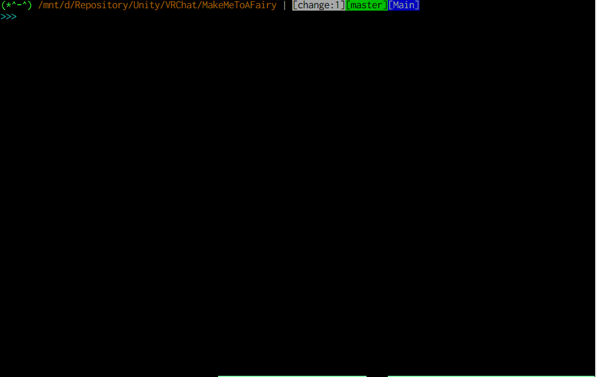

# :diamond_shape_with_a_dot_inside: git-lfs-install-append :diamond_shape_with_a_dot_inside:
## Problem

Often we cannot use `$ git lfs install` because we already have `.git/hooks/*`.

For this problem, git-lfs provide `$ git lfs install --manual`.
But now, the manually operation is required :cry:

## Solve

**git-lfs-install-append** solves this problem!

git-lfs-install-append provides a way to append needed lines already existent git-hooks scripts.  
Instead of the manually operation.  
With your favorite choice :3

## :dizzy: How to use this :dizzy:
### Installation

```shell-session
$ git clone https://github.com/aiya000/sh-git-lfs-install-append ~/git  # ~/git or an another directory you like
$ echo 'export PATH=$PATH:~/git/sh-git-lfs-install-append' >> ~/.bashrc  # or your shell configuration file

# Please restart your shell :3
```

### Usage

```shell-session
$ cd <a git project that never installed git-lfs hooks>
$ git-lfs-install-append

# Please input your choice to install git-lfs hooks
```


